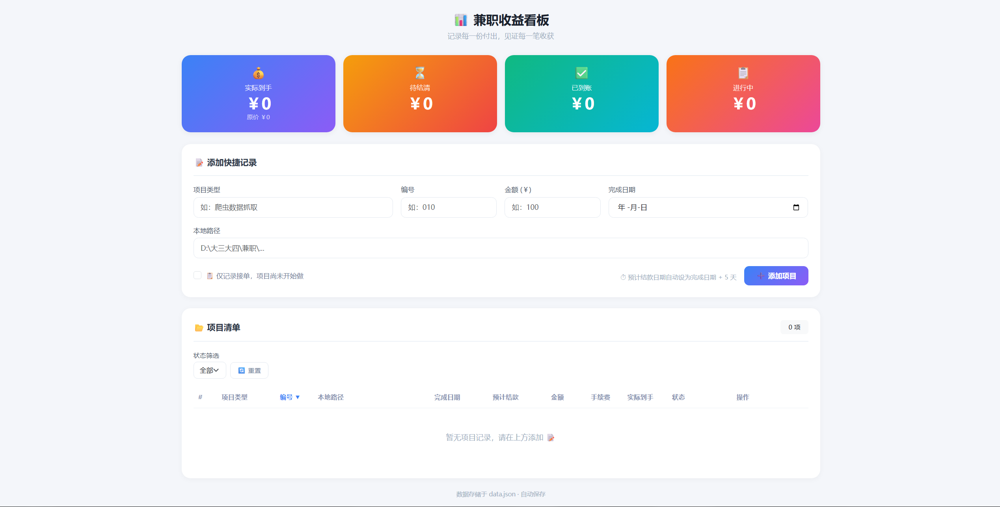

# Income Dashboard

A lightweight local web application for tracking and managing freelance / part-time project income. Built with Python Flask and Bootstrap 5, with JSON file-based storage — no database setup required.



## Features

- **Record Management** — Add projects with type, ID, amount, completion date, and local path
- **Auto Date Calculation** — Expected settlement date is automatically set to completion date + 5 days
- **Settlement Toggle** — One-click mark as settled / unsettled
- **Progress Tracking** — Mark projects as in-progress or complete
- **Fee Deduction** — Record platform fees per project, automatically calculates net amount
- **Sorting & Filtering** — Sort by ID, date, amount, or fee; filter by settlement status
- **Statistics Cards** — Top-level summary: total net, pending, settled, and in-progress amounts
- **Persistent Storage** — All data saved locally in `data.json`

## Tech Stack

| Component | Technology |
|-----------|-----------|
| Backend   | Python + Flask |
| Frontend  | Bootstrap 5 |
| Data      | JSON file |

## Getting Started

### Prerequisites

- Python 3.7+
- Flask

### Installation

```bash
pip install -r requirements.txt
```

### Usage

```bash
python app.py
```

The app will automatically open `http://127.0.0.1:9000` in your browser.

### Sample Data

A sample data file `data.example.json` is provided. To use it:

```bash
cp data.example.json data.json
```

## Project Structure

```
income-dashboard/
├── app.py                  # Flask application entry point
├── data.json               # Data storage (excluded from git)
├── data.example.json       # Example data for reference
├── index.png               # Application screenshot
├── requirements.txt        # Python dependencies
├── templates/
│   └── index.html          # Frontend template
├── .gitignore
└── README.md
```

## Data Format

Each record in `data.json` has the following structure:

| Field                     | Description          |
|---------------------------|----------------------|
| `id`                      | Project ID           |
| `type`                    | Project type         |
| `path`                    | Local file path      |
| `completion_date`         | Completion date      |
| `expected_settlement_date`| Expected settlement  |
| `amount`                  | Amount (integer)     |
| `fee`                     | Platform fee         |
| `completed`               | Completion status    |
| `settled`                 | Settlement status    |

## License

MIT
